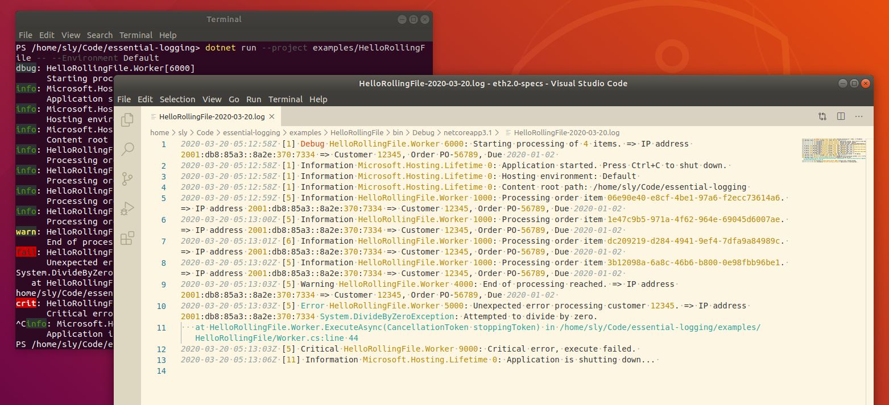

# HelloRollingFile

This logger provider writes to a rolling log file, using a custom template, with the file rotated based on the time, e.g. daily, hourly, etc.

## Running the Example

The example program can be run from the command line. It has some examples of custom settings and will create a `Log-xxxx.log` file in the current directory.

```powershell
dotnet run --project HelloRollingFile
```

You can also run with an environment override file of `Default`, which contains the default settings:

```powershell
dotnet run --project HelloRollingFile -- --Environment Default
```

This will create a file `HelloRollingFile-xxxx.log` in the application directory, e.g. `bin/Debug/netcoreapp3.1`.



## Configuration

Examples of both a custom configuration (`appsettings.json`) and the default settings (`appsettings.Default.json`) are provided.

Full details of the configuration, including the available template arguments, are in the RollingFileLoggerProvider project.

* See [RollingFileLoggerProvider](../../src/Essential.LoggerProvider.RollingFile)
